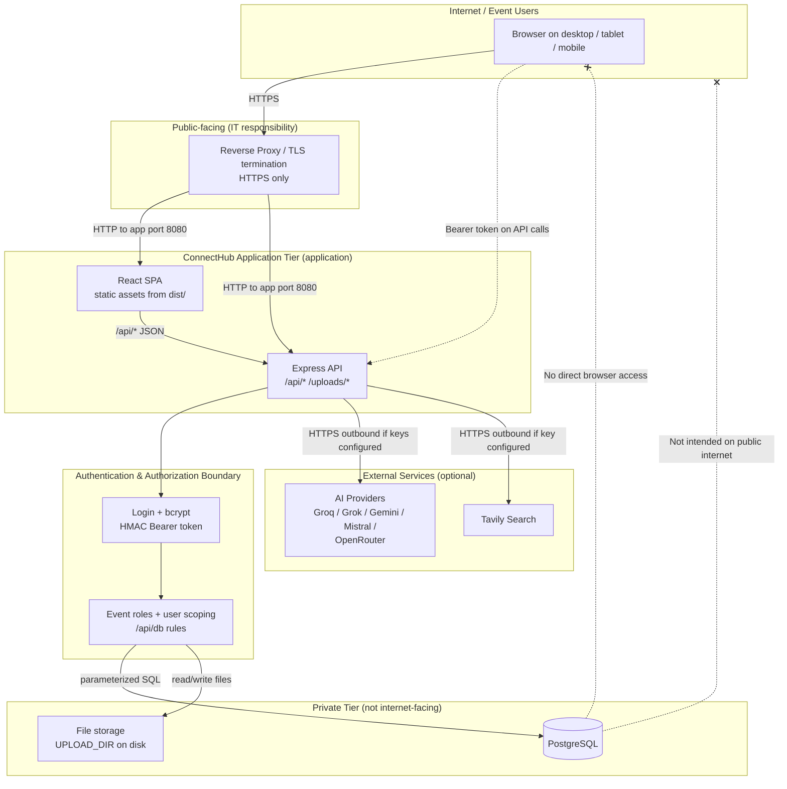

# ConnectHub — System Architecture & Security Architecture

**Document purpose:** Factual architecture reference for Security and IT review.  
**Verification basis:** Repository source code and configuration as of the post-remediation codebase (commit including pilot security hardening).  
**Scope:** Application architecture, deployment assumptions, security controls, and review status.  
**Not in scope:** Formal security approval, penetration test results, or SAST certification.

---

## 1. Verified current architecture

### 1.1 Components (verified in code)

| Component | Technology | Evidence |
|-----------|------------|----------|
| Frontend | React 18 + TypeScript SPA | `ConnectHub/package.json`, `ConnectHub/src/` |
| Build tool | Vite 5 | `ConnectHub/vite.config.ts` |
| Backend API | Node.js Express 4 (ES modules) | `ConnectHub/server/index.js` |
| Database | PostgreSQL via `pg` connection pool | `init-schema.sql`, `ConnectHub/server/pgConfig.js` |
| ORM | None — parameterized SQL | `ConnectHub/server/index.js` (`buildWhere`, `/api/db`) |
| File storage | Local filesystem (`UPLOAD_DIR`) | `ConnectHub/server/index.js` |
| AI integrations | Optional server-side providers | `ConnectHub/server/aiRouter.js` |
| Container deployment | Docker Compose (optional) | `docker-compose.yml`, `Dockerfile` |

### 1.2 Network ports (verified)

| Environment | Frontend | API | PostgreSQL |
|-------------|----------|-----|------------|
| Local development | Vite **3556** (proxies `/api`, `/uploads` → 3001) | Express **3001** | **5433** (local dev cluster) or configured `DATABASE_URL` |
| Production / office (`npm run office`, Docker) | Served by Express on **8080** | Same process, **8080** | **5432** internal to Docker network; not published in `docker-compose.yml` |

HTTPS is **not** terminated inside the Node application. Production assumes a reverse proxy or tunnel provides TLS.

### 1.3 Data path confirmations

| Path | Exists? | Evidence |
|------|---------|----------|
| Browser → Frontend (SPA) | **Yes** | Static `dist/` or Vite dev server |
| Browser → Express API | **Yes** | `fetch('/api/...')`, `localDbClient.ts` |
| Browser → PostgreSQL directly | **No** | All DB access via Express |
| Internet → PostgreSQL | **Not intended** | DB is backend-only; Docker `db` service has no host port mapping |
| Express → PostgreSQL | **Yes** | `pg.Pool`, `DATABASE_URL` |
| Express → external AI APIs | **Yes (optional)** | `aiRouter.js`, `/api/ai/chat`, `peopleIngest.js`, `conversationAI.js` |
| Express → Tavily search | **Yes (optional)** | `/api/ai/search` when `TAVILY_API_KEY` set |

### 1.4 Authentication (verified)

- Username/password login: `POST /api/auth/login` (`ConnectHub/server/index.js`)
- Password hashing: **bcrypt** (cost factor 10) — `ConnectHub/server/auth.js`
- Session mechanism: custom **HMAC-signed bearer token** (7-day expiry), not a JWT library — `signToken()` / `verifyToken()` in `auth.js`
- Token storage (browser): `localStorage` key `connecthub_token` — `ConnectHub/src/lib/authService.ts`
- No SSO, OAuth, MFA, or self-registration in codebase
- Admin-provisioned users: `POST /api/admin/users` (admin only)
- Initial admin: `npm run db:seed` using `ADMIN_USERNAME` / `ADMIN_PASSWORD` in `server/.env`

### 1.5 Authorization (verified)

- API routes call `authenticate()` or `requireAuthMiddleware`
- Generic data access: `POST /api/db` with table allowlist and per-table rules (`ALLOWED_TABLES`, `PRIVATE_TABLES`, `scopePrivateRequest`, `getEventRole`, `getAccessibleEventIds`)
- Event roles: `view` / `edit` via `event_access_grants` and event ownership
- Admin flag: `users.is_admin` checked via `requireAdmin()`
- Attendee photos: `GET /api/attendees/:id/photo` requires auth + event access (`getEventRole`) — post-remediation

### 1.6 File storage and uploads (verified, post-remediation)

- Upload root: `UPLOAD_DIR` (default `ConnectHub/server/uploads`)
- Public static: `express.static` on `/uploads` with path blocking middleware
- **Blocked from public static:** `/uploads/private/*`, `/uploads/assets/*`, `/uploads/assets-tmp/*`, legacy `/uploads/ingest-last.*`
- **Auth-gated static:** `/uploads/conversation-audio/*` (owner or admin)
- **Still publicly servable if URL known:** `/uploads/avatars/*`, `/uploads/profile-pictures/*`, `/uploads/event-images/*`, `/uploads/qr-codes/*`, `/uploads/repository/*`
- Corporate assets: served via authenticated API `GET /api/assets/items/:id/content` (`assetLibrary.js`)
- Ingest debug files: written to `UPLOAD_DIR/private/ingest/` (not web-accessible)
- Attendee photo bytes: PostgreSQL `BYTEA` and/or filesystem; canonical URL `/api/attendees/:id/photo`

### 1.7 AI integrations (verified, optional)

Providers configured in `aiRouter.js` when API keys are present in `server/.env`:

- Groq, Grok, Gemini, Mistral, OpenRouter
- Tavily (web search) via `/api/ai/search`
- All AI calls are **server-side**; keys are not `VITE_*` frontend variables
- Features can be disabled by omitting provider keys (endpoints return HTTP 501)

### 1.8 CORS and production guards (verified, post-remediation)

- CORS origins: `ALLOWED_ORIGINS` (comma-separated) — `ConnectHub/server/index.js`
- Development: empty `ALLOWED_ORIGINS` allows all browser origins (warning logged)
- Production (`NODE_ENV=production`): process **exits at startup** if `ALLOWED_ORIGINS` is empty
- Production: process **exits at startup** if `AUTH_SECRET` is default/insecure
- Office serve (`--serve`): also exits if `AUTH_SECRET` is insecure

### 1.9 Secrets (verified)

- Runtime secrets in `ConnectHub/server/.env` (gitignored)
- Examples only in `ConnectHub/server/.env.example`, `.env.docker.example`
- `LOGIN_CREDENTIALS.md` removed from repository (post-remediation)
- No credentials documented in this file

---

## 2. System architecture diagram



### Trust boundaries

| Boundary | Inside | Outside / Untrusted |
|----------|--------|---------------------|
| B1 — User device | Authenticated session token in browser storage | Other users, malicious scripts (XSS risk) |
| B2 — Reverse proxy | TLS, optional WAF/IP allowlist (IT) | Raw HTTP from internet |
| B3 — Application | AuthZ checks before data access | Unauthenticated API callers (blocked on protected routes) |
| B4 — Database | Application credentials only | Direct client connections (not supported) |
| B5 — AI providers | Outbound API calls with server keys | User data in prompts when AI enabled |

---

## 3. Deployment architecture

### 3.1 Expected production topology

```text
Internet
   |
   |  HTTPS (443)
   v
Reverse Proxy / Load Balancer          <-- IT RESPONSIBILITY
   |
   |  HTTP to ConnectHub host:8080
   v
ConnectHub Node process                <-- APPLICATION
   |-- serves React SPA (dist/)
   |-- serves /api/*
   |-- serves /uploads/* (partial)
   |
   +-- PostgreSQL (private network)    <-- IT RESPONSIBILITY (hosting + firewall)
   +-- UPLOAD_DIR volume/disk          <-- APPLICATION path, IT disk/volume
   +-- outbound HTTPS to AI APIs       <-- APPLICATION config, IT egress policy
```

### 3.2 Responsibility matrix

| Item | Application responsibility | Infrastructure / IT responsibility |
|------|---------------------------|--------------------------------------|
| Public URL / DNS | — | Provision event-specific hostname |
| HTTPS / TLS certificates | — | Terminate TLS at reverse proxy |
| HTTP → HTTPS redirect | — | Configure at proxy |
| ConnectHub listen port | **8080** (`OFFICE_PORT` / Docker) | Open inbound 443→8080 only |
| PostgreSQL port | Uses `DATABASE_URL` | Keep **5432/5433 off public internet**; private network or Docker internal |
| Firewall | — | Allow 443 inbound; restrict admin/DB ports |
| `AUTH_SECRET` | Read from env; refuse insecure in production | Generate and inject strong secret |
| `ALLOWED_ORIGINS` | Enforce in production startup | Set to `https://<event-domain>` |
| `DATABASE_URL` | Connection via `pg` | Provision DB, credentials, SSL if remote |
| `ADMIN_*` / user accounts | Seed + admin API | Operational password policy |
| `UPLOAD_DIR` | Application reads/writes | Persistent volume, backups |
| AI provider keys | Server `.env` only | Approve outbound internet; optional disable |
| Backups | — | `pg_dump` / volume backup (documented in `ARCHITECTURE.md`) |
| Monitoring / logging | Application logs to stdout | Centralized log collection |

### 3.3 Environment variables (production)

Required for production startup (application-enforced):

| Variable | Purpose |
|----------|---------|
| `NODE_ENV=production` | Enables production guards |
| `AUTH_SECRET` | Token signing (must not be default) |
| `ALLOWED_ORIGINS` | CORS allowlist (comma-separated HTTPS origins) |
| `DATABASE_URL` | PostgreSQL connection string |

Commonly required:

| Variable | Purpose |
|----------|---------|
| `ADMIN_USERNAME` / `ADMIN_PASSWORD` | Initial admin (seed) |
| `SERVE_STATIC=1` or `--serve` | Combined SPA + API on one port |
| `UPLOAD_DIR` | Writable upload path (e.g. `/data/uploads` in Docker) |
| `PORT` / `OFFICE_PORT` | Listen port (default **8080** in office/Docker) |

Optional:

| Variable | Purpose |
|----------|---------|
| `GROQ_API_KEY`, `GROK_API_KEY`, `GEMINI_API_KEY`, `MISTRAL_API_KEY`, `OPENROUTER_API_KEY` | AI features |
| `TAVILY_API_KEY` | Web search feature |

Reference templates: `ConnectHub/server/.env.example`, `.env.docker.example`

### 3.4 Docker Compose (optional)

`docker-compose.yml` defines:

- `app` service: published port **8080**
- `db` service: PostgreSQL 16, **no published host port** (internal network only)
- Volume `connecthub_uploads` mounted at `/data/uploads`

---

## 4. Security architecture (implemented controls)

Controls verified in source code. This is **not** a certification of adequacy.

| Control | Implemented | Location / notes |
|---------|-------------|------------------|
| Authentication (password) | Yes | `/api/auth/login`, `auth.js` |
| bcrypt password hashing | Yes | `hashPassword()`, cost 10 |
| Bearer token (HMAC) | Yes | `signToken()`, `verifyToken()` |
| Token expiration | Yes | 7 days (`TOKEN_TTL_MS`) |
| Server-side session revocation | **No** | Stateless tokens until expiry |
| Authorization / RBAC | Yes | `getEventRole`, `scopePrivateRequest`, `/api/db` rules |
| Admin-only user provisioning | Yes | `/api/admin/users` |
| No public self-registration | Yes | No register endpoint |
| Rate limiting | Partial | `/api` 240/min; login & PIN 10/15 min |
| Helmet | Yes | CSP disabled explicitly |
| CORS | Yes | `ALLOWED_ORIGINS`; production startup guard |
| SQL parameterization | Yes | `$1` placeholders, table/column allowlists |
| Upload MIME + magic-byte checks | Yes | Storage upload `fileFilter`, `hasImageSignature` |
| Private upload paths blocked | Yes | `isBlockedPublicUploadPath()` |
| Conversation audio upload auth | Yes | Middleware on `/uploads/conversation-audio` |
| Attendee photo auth | Yes | `/api/attendees/:id/photo` + `getEventRole` |
| Production `AUTH_SECRET` guard | Yes | Startup exit in production / `--serve` |
| Production `ALLOWED_ORIGINS` guard | Yes | Startup exit when `NODE_ENV=production` |
| Secrets in frontend bundle | No AI/DB keys | `VITE_*` limited to API URL, logo versions |

**Not implemented (do not claim):** MFA, SSO, OAuth, WAF, RLS in PostgreSQL, formal audit logging, malware scanning, HttpOnly cookie sessions, full CSP, server-side token revocation.

---

## 5. Data flows

### 5.1 Primary request flow

```text
User
  → Browser (React SPA)
  → HTTPS → Reverse Proxy
  → Express /api/*
  → authenticate() + authorization rules
  → PostgreSQL (parameterized queries)
```

Frontend data access uses `localDbClient.ts` → `POST /api/db` (Supabase-shaped API, local implementation only).

### 5.2 Data types by boundary

| Data type | Browser | Express API | PostgreSQL | Filesystem | External AI |
|-----------|---------|-------------|------------|------------|-------------|
| Login credentials | Sent once at login | Verified, not stored plain | `password_hash` (bcrypt) | — | — |
| Session token | `localStorage` | Validated per request | — | — | — |
| User profile | Display | CRUD via `/api/db` | `user_profiles` | Avatar files optional | — |
| Event metadata | Display | CRUD, access grants | `events`, `event_access_grants` | Event images optional | — |
| Attendee roster | Display | CRUD, scoped by event access | `attendees` | — | — |
| Attendee photos | `` via API URL + token | AuthZ + bytes | `profile_pic` BYTEA | `/uploads/profile-pictures` possible | — |
| Private notes / stages | Display/edit | User-scoped `/api/db` | `attendee_notes`, etc. | — | — |
| Conversations / transcripts | Display | User-scoped | `conversations`, `transcript_segments` | Audio in `/uploads/conversation-audio` | Analysis prompts if AI on |
| People ingest (Excel/Word) | Upload to API | Parse server-side | `attendees` upsert | Private ingest copy | Extract prompts if AI on |
| Jelly chat / AI chat | Messages | `/api/ai/chat` | Optional usage logs | — | Prompts + responses |
| Web search | Query | `/api/ai/search` | — | — | Tavily |

No actual personal data or credentials are stored in this document.

### 5.3 AI data flow (when enabled)

```text
Authenticated user
  → POST /api/ai/chat | people ingest | conversation analyze
  → Express (server-side)
  → HTTPS → External AI provider API
  → Response → Express → Browser
```

AI can be disabled for the event pilot by omitting all provider API keys in `server/.env`.

---

## 6. Security review status

### Architecture design

**YES** — This document and `ARCHITECTURE.md` describe the system design. This document reflects the **current post-remediation** implementation.

### Formal security architecture review

**NOT EVIDENCED / NOT PERFORMED** — No formal security sign-off, threat-model workshop record, or third-party architecture review was found in the repository.

### SAST

**NO FORMAL SAST REPORT FOUND** — No CodeQL, Semgrep, SonarQube, or CI security scan configuration in the repository.

### Penetration testing

**NOT PERFORMED** — No penetration test report in the repository.

### Application security tests (not SAST / not pen test)

Automated API security tests exist in `ConnectHub/server/security.test.js`.

**Latest verified run (post-remediation):**

| Metric | Result |
|--------|--------|
| Total server tests | 61 |
| Passed | 60 |
| Skipped | 1 (live integration suite) |
| Failed | 0 |

Security-focused tests include (non-exhaustive):

- Password hashing and token tampering rejection
- Private table `user_id` scoping cannot be overridden by client
- Authentication required for DB mutations and uploads
- Login response does not include password hash
- Stale write conflict (HTTP 409)
- Event PIN behavior
- Attendee insight scoping
- **Attendee photo:** unauthenticated → 401; unauthorized user → 403; authorized → 200; unknown ID → 404
- **Private upload paths** not publicly served

These tests validate specific application behaviors; they do **not** replace SAST or penetration testing.

---

## 7. Restricted event pilot — 7–8 users

**Intended use:** Short event (e.g. 9–10 September), small known user group, single event domain.

| Control | Pilot approach |
|---------|----------------|
| Users | 7–8 **admin-provisioned** accounts; **no public registration** |
| Authentication | Username/password + bearer token |
| Transport | **HTTPS** via reverse proxy (IT) |
| URL | Event-specific hostname; `ALLOWED_ORIGINS` set to that origin |
| Database | **Private** PostgreSQL; not internet-exposed |
| CORS | Explicit `ALLOWED_ORIGINS` (production guard) |
| AI | **Optional** — can be disabled by omitting API keys |
| Scope | Single or few private events; access grants and optional event PIN |
| Network | Optional VPN or IP restriction (IT) |

**Pilot ≠ public deployment.** Residual risks accepted for pilot may include: bearer token in browser storage, some public `/uploads` paths (avatars/repository), no MFA, no formal pen test.

---

## 8. Public deployment — additional controls required

Before broad public internet deployment, the following are **not** evidenced as complete in the repository:

| Area | Gap |
|------|-----|
| SAST | No pipeline or report |
| Penetration testing | Not performed |
| Dependency remediation | Known `npm audit` findings (e.g. server `xlsx`) not resolved |
| Session architecture | No server-side revocation; localStorage bearer tokens |
| MFA / SSO | Not implemented |
| Upload exposure | Some `/uploads` paths remain public if URL is known |
| AI / data governance | Legal/privacy review for third-party AI processing |
| Security headers | CSP disabled; HSTS at proxy recommended |
| Git history | Historical credential exposure may require rotation or history purge |

---

## 9. Security architecture summary table

| Area | Current state | Evidence | Formal security review? |
|------|---------------|----------|-------------------------|
| **Architecture** | Documented; React + Express + PostgreSQL + optional AI | `ARCHITECTURE.md`, this document, `server/index.js` | **No** |
| **Authentication** | Password + bcrypt + HMAC bearer token (7d) | `auth.js`, `/api/auth/login` | **No** |
| **Authorization** | Event roles, user-scoped private tables, admin API | `index.js`, `security.test.js` | **No** |
| **Database** | PostgreSQL, parameterized SQL, no browser access | `pg`, `/api/db`, `init-schema.sql` | **No** |
| **File storage** | Local disk; partial public static; private ingest blocked | `UPLOAD_DIR`, upload middleware | **No** |
| **API security** | Auth on protected routes, rate limits, Helmet | `index.js`, `security.test.js` | **No** |
| **AI integrations** | Optional server-side providers | `aiRouter.js` | **No** |
| **Infrastructure** | Assumes private DB + HTTPS proxy | `docker-compose.yml`, deployment docs | **IT operational review** (not in repo) |
| **SAST** | Not implemented | No CI/SAST config | **No** |
| **Penetration testing** | Not performed | No report in repo | **No** |

---

## Appendix A — Discrepancies vs. root `ARCHITECTURE.md`

| Topic | `ARCHITECTURE.md` says | Current code (verified) |
|-------|------------------------|-------------------------|
| AI providers | Mentions Groq only | Multiple providers in `aiRouter.js` + Tavily |
| “Every request requires auth” | Broad statement | `/api/health`, `/api/ready`, `/api/branding`, parts of `/uploads` are unauthenticated |
| “Next phase” features | Lists conversation/RAG as future | `conversations`, `conversation_insights`, Jelly chat tables and APIs **exist** |
| Attendee photos | Not mentioned | Now auth + event-scoped (`/api/attendees/:id/photo`) |
| Upload security | Generic “approved buckets” | Additional blocked paths (`private/`, `assets/`, ingest) post-remediation |
| CORS / production | Warn only | Production **fails startup** if `ALLOWED_ORIGINS` empty |
| Private event access | PIN mentioned | PIN via `verify-pin` + `event_access_grants`; private vs public events |

**Recommendation:** Retain `ARCHITECTURE.md` for onboarding; use **this document** for Security/IT review.

---

## Appendix B — Related repository documents

| Document | Purpose |
|----------|---------|
| `ARCHITECTURE.md` | High-level local/on-prem overview |
| `ON_PREMISE_DEPLOYMENT.md` | Deployment guidance |
| `docker-compose.yml` | Container topology |
| `ConnectHub/server/.env.example` | Safe configuration template |
| `ConnectHub/server/security.test.js` | Automated security behavior tests |

---

*Document generated for Security/IT review. Does not constitute formal approval or certification.*
